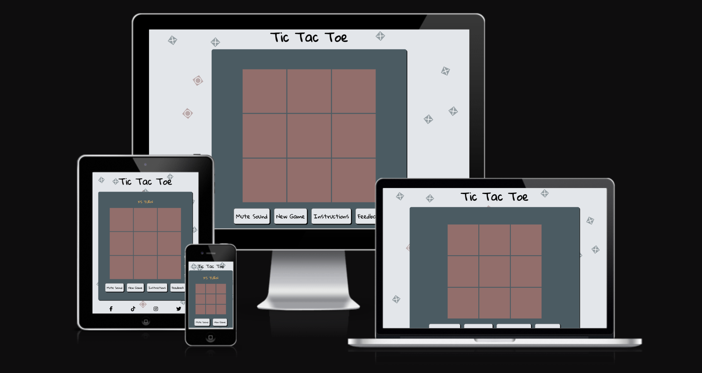
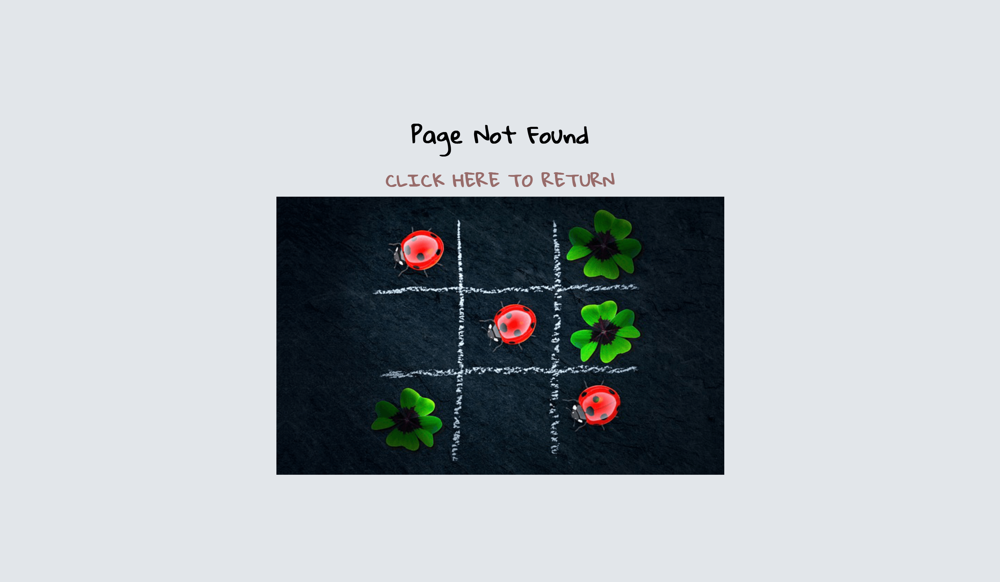
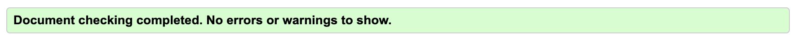
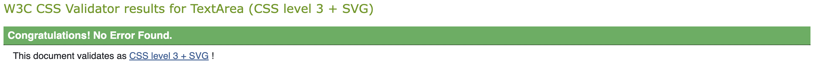
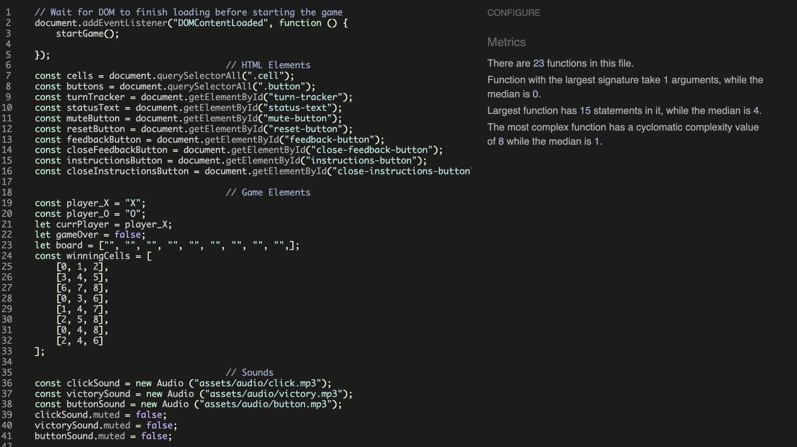
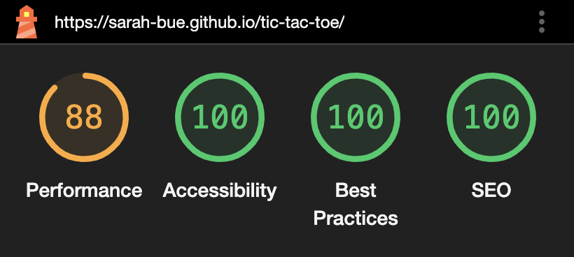
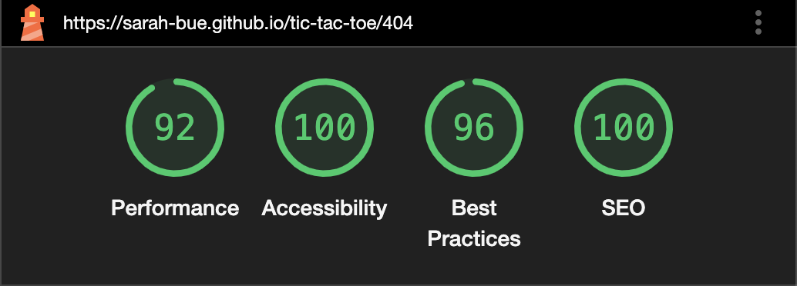
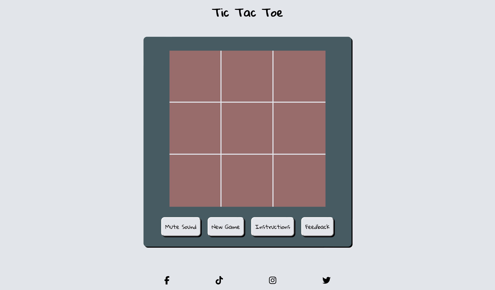
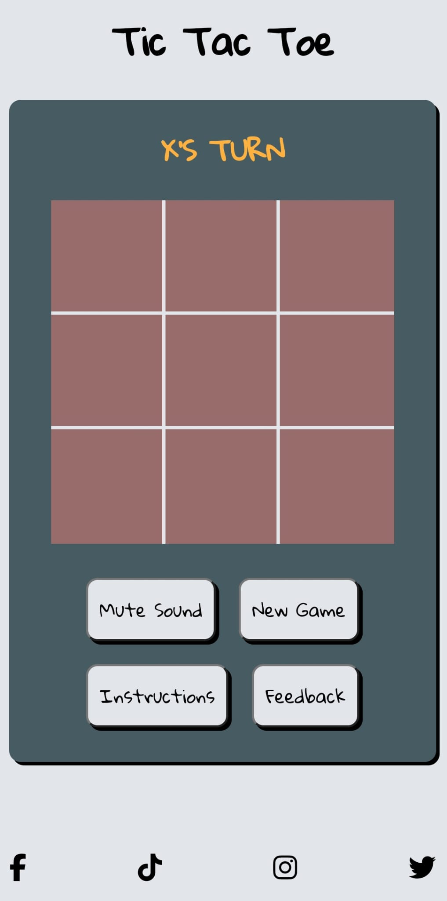

# Tic Tac Toe

This website is a simple online version of the classic turn-taking game Tic Tac Toe. Everything the user needs, from starting the game to reading the instructions and providing feedback, is easily accessible from the main page.

Visit the deployed website [here](https://sarah-bue.github.io/tic-tac-toe/).

## Table of contents
1. [User Experience (UX)](#user-experience-ux)
    1. [Project Goals](#project-goals)
    2. [User Stories](#user-stories)
    3. [Color Scheme](#color-scheme)
    4. [Typography](#typography)
    5. [Wireframes](#wireframes)
2. [Features](#features)
3. [Technologies Used](#technologies-used)
    1. [Languages](#languagesd)
    2. [Frameworks, Libraries, and Programs](#frameworks-libraries-and-programs)
4. [Testing](#testing)
    1. [Testing User Stories](#testing-user-stories)
    2. [Code Validation](#code-validation)
    3. [Accessibility](#accessibility)
    4. [Tools Testing](#tools-testing)
    5. [Manual Testing](#manual-testing)
5. [Finished Product](#finished-product)
6. [Deployment](#deployment)
    1. [GitHub Pages](#github-pages)
7. [Credits](#credits)
    1. [Content](#content)
    2. [Media](#media)
    3. [Code](#code)
8. [Acknowledgements](#acknowledgements)

## User Experience (UX)
### Project Goals
- The website incorporates a responsive design to make the game accessible on different devices.
- The website should provide an intuitive structure and navigation.
- The website should allow the user to provide feedback about their experience.
- The website should have a pleasant, coherent design to invite the user to play.
- The website should provide the user with feedback about their game result.

### User Stories
- As a user, I want the website to be easy to navigate.
- As a user, I want the game to be fun and engaging.
- As a user, I want to receive feedback about my performance in the game.
- As a user, I want to be able to provide feedback about the game and the website.
- As a user, I want to be able to easily review the rules.
- As a user, I want to be able to play the game on different devices.

### Color Scheme

The body of the website uses an off-white color (#E2E6EA - Anti-Flash White), combined with a medium grey color (#475B63 - Payne's Gray) for the main area.

The board itself uses a brown-grey color (#986C6A - Rose Taupe), with player marks and grids displaying in the off-white color of the body.

Win / Draw announcements are displayed in a brighter, orange color (#FFB140 - Orange (web)).

### Typography

The site uses Gloria Hallelujah, imported from Google Fonts, as its main font.

The fallback font, in case Gloria Hallelujah isn't loaded correctly, is Sans Serif.

### Wireframes

Page | Desktop Version | Mobile Version
--- | --- | ---
Home |  | 
Feedback |  | 
Instructions |  | 
404 |  | 

[Back to top ⇧](#tic-tac-toe)

## Features
### General
- The site was built using a mobile-first approach. 
- Media queries were used to adapt features for larger screens to ensure responsive designs across different screen sizes. 

**Header**

- The header contains the name of the website, which is identical to the name of the game.

**Footer**

- The footer contains links to the website's social media channels.

### Board Area
**Board**

- The board starts with all cells being empty.
- When pressing the "New Game" button, the board returns to this state.
- Instructions and Feedback Popups are hidden by default.
- If the game is unmuted, a sound will be heard when clicking the cells, and a different sound when clicking the buttons.

**Hover Effect**

- When hovering over a cell, a slightly transparent version of the current player's symbol appears to indicate whose turn it is.
- The symbol changes depending on the current player; varying between X and O.

**Win / Draw Announcement**

- When a Win or a Draw is achieved, an announcement appears below the board.
- The announcement changes depending on which player won.
- If the game is unmuted, a victory sound will be played.

### Popups
**Instructions Popup**

- Clicking on the "Instructions" button opens the "Instructions" popup.
- It overlaps the board to focus the player's attention on the rules.
- Images showcase the different ways the game can be won.
- When the "Instructions" popup is open, the "Instructions" button below the board is hidden.
- The section can be closed by using the "X" button in the top right corner. This will make the original button reappear below the board.

**Feedback Popup**

- Clicking on the "Feedback" button opens the "Feedback" popup.
- It overlaps the board to focus the user's attention on the form.
- The form allows the user to provide feedback about their experience with the game.
- When the "Feedback" popup is open, the "Feedback" button below the board is hidden.
- The section can be closed by using the "X" button in the top right corner. This will make the original button reappear below the board.

### 404 Page

- This page is displayed in case of broken or misspelled links, and contains a link back to the main page.

[Back to top ⇧](#tic-tac-toe)

## Technologies Used
### Languages
- [HTML5](https://en.wikipedia.org/wiki/HTML5)
- [CSS3](https://en.wikipedia.org/wiki/CSS)
- [Javascript](https://en.wikipedia.org/wiki/JavaScript)

### Frameworks, Libraries, and Programs 
- [Google Fonts](https://fonts.google.com/) was used to find suitable font pairings, as well import the chosen fonts.

- [Font Awesome](https://fontawesome.com/) was used to add icons in order to create a better visual experience for UX purposes.

- [Favicon](favicon.io) was used to create and import a favicon for the website.

- [Coolors](https://coolors.co/) was used to generate a color palette for the website.

- [JPG to PNG](https://jpg2png.com/) was used to convert all images to PNG format.

- [GitPod](https://gitpod.io/) was used for writing code, committing, and then pushing to GitHub.

- [GitHub](https://github.com/) was used to store the project after pushing.

- [Balsamiq](https://balsamiq.com/) was used to create the wireframes during the design phase of the project.

- [Am I Responsive?](http://ami.responsivedesign.is/#) was used to ensure responsive design throughout the process and to generate the mockup images at the top of this file.

- [Chrome DevTools](https://developer.chrome.com/docs/devtools/) was used during the development process for code review and to test responsiveness and accessibility.

- [W3C Markup Validator](https://validator.w3.org/) was used to validate the HTML code.

- [W3C CSS Validator](https://jigsaw.w3.org/css-validator/) was used to validate the CSS code.

- [JSHint](https://jshint.com/) was used to validate the site's JavaScript code.

[Back to top ⇧](#tic-tac-toe)

## Testing
### Testing User Stories
- As a user, I want the website to be easy to navigate.
 - Everything is presented on one page to minimize the need to switch between pages.
 - Buttons are clearly labelled and easy to find.

- As a user, I want the game to be fun and engaging.
 - The website is kept in simple, soothing colors to provide a pleasant experience.
 - The game is straightforward and can be played immediately.
 - The game plays sound effects similar to ones used in retro-style games to be fun for the user.
 - The game provides feedback and a victory sound to keep the user motivated and engaged.

- As a user, I want to receive feedback about my performance in the game.
 - The game provides feedback after a game is won.
 - At the end of the game, a victory sound plays.

- As a user, I want to be able to provide feedback about the game and the website.
 - A feedback form is available via the "Feedback" button below the game board.
 - The user can provide their name and email address, as well as their feedback in the comment field.

- As a user, I want to be able to easily review the rules.
 - The instructions are readily available via the "Instructions" button below the game board.
 - The instructions are kept clear and concise, and contain images of sample Wins to demonstrate possible outcomes across the different axes.

- As a user, I want to be able to play the game on different devices.
 - The website is fully responsive and displays well across devices of different sizes.
 - The game is fully interactive on touchscreen devices as well when using a mouse or trackpad.
 - On smaller screens, where a hover effect is not possible, a visual indicator is used above the board to keep track of which player's turn it is.

### Code Validation
[W3C Markup Validator](https://validator.w3.org/), [W3C CSS Validator](https://jigsaw.w3.org/css-validator/), and [JSHint](https://jshint.com/) were used to validate the project to ensure there were no errors in the code.

**HTML Validation**
 

**CSS Validation**
 

**JavaScript Validation**

 

### Accessibility

**Lighthouse Reports**
[Lighthouse](https://developer.chrome.com/docs/lighthouse/overview) in [Chrome DevTools](https://developer.chrome.com/docs/devtools/) was used to measure the quality of each page, focussing on performance, accessibility, best practices, and SEO scores.

**Lighthouse Reports**
- Home Page
 

- 404 Page
 

### Tools Testing

### Manual Testing
**Browser Compatibility**
Browser | Outcome | Pass/Fail
--- | --- | ---
Google Chrome | No issues with appearance, responsiveness, or functionality. | Pass
Safari | No issues with appearance, responsiveness, or functionality. | Pass
Mozilla Firefox | No issues with appearance, responsiveness, or functionality. | Pass
Microsoft Edge | No issues with appearance, responsiveness, or functionality. | Pass
JoyUI Native Browser | No issues with appearance, responsiveness, or functionality. | Pass

**Device Compatibility**
Device | Outcome | Pass/Fail
--- | --- | ---
MacBook Pro 13" | No issues with appearance, responsiveness, or functionality. | Pass
iPhone 13 Mini | No issues with appearance, responsiveness, or functionality. | Pass
iPad 9th Generation | No issues with appearance, responsiveness, or functionality. | Pass
Acer Predator Helios 300 | No issues with appearance, responsiveness, or functionality. | Pass
Black Shark PAR-HOA | No issues with appearance, responsiveness, or functionality. | Pass
Samsung Galaxy S23 | No issues with appearance, responsiveness, or functionality. | Pass

**Common Elements Testing**

Board
Feature | Outcome | Pass/Fail
--- | --- | ---
Win Achieved | A message appears below the board to announce the outcome of the game, depending on the turn | Pass
Win Achieved | A short victory sound is played | Pass
Draw Achieved | A message appears below the board to announce the outcome of the game | Pass
Draw Achieved | A short victory sound is played | Pass
Win Achieved | A short victory sound is played | Pass
Turn Tracker | On smaller devices, a turn indicator above the game board keeps track of player turns | Pass

Cells
Feature | Outcome | Pass/Fail
--- | --- | ---
Hovering over a cell | Translucent X or O appears, depending on the turn | Pass
Clicking on a cell | X or O placed in cell, depending on the turn | Pass
Clicking on a cell | A short sound is played | Pass
Locked Board | No placements or hover effect after Win / Draw is achieved | Pass

Buttons
Feature | Outcome | Pass/Fail
--- | --- | ---
Hovering over a button | Inverts colors | Pass
Clicking on a button | A short sound is played | Pass
Clicking on the Mute button | The sound is muted / unmuted depending on the current state | Pass
Clicking on the Mute button | The button text changes between "Play Sound" and "Mute Sound" depending on the state | Pass
Clicking on the "Instructions" button | A popup opens with additional information | Pass
Clicking on the "Feedback" button | A popup opens with additional information | Pass

Popup Sections
Feature | Outcome | Pass/Fail
--- | --- | ---
Clicking on the "Instructions" button | A popup opens with additional information | Pass
Clicking on the "Instructions" button | The "Instructions" button disappears | Pass
Clicking on the "Feedback" button | A popup opens with additional information | Pass
Clicking on the "Feedback" button | The "Feedback" button disappears | Pass
Clicking on the "X" button | The popup closes | Pass
Clicking on the "X" button | The "Instructions" or "Feedback" button reappears | Pass

Form
Feature | Outcome | Pass/Fail
--- | --- | ---
Input Fields | All fields are required to submit the form | Pass
Hovering over the "Submit" button | Inverts colors | Pass
Form Submission | Form information is taken to Code Institute's [formdump page](https://formdump.codeinstitute.net/) | Pass

Footer
Feature | Outcome | Pass/Fail
--- | --- | ---
Clicking on the Social Media Icons | The respective website is opened in a new tab | Pass

404 Page
Feature | Outcome | Pass/Fail
--- | --- | ---
404 Page | A broken or misspelled address will redirect the user to the 404 page | Pass
Clicking on the link | The user is taken back to the main page | Pass

[Back to top ⇧](#tic-tac-toe)

## Finished Product

Page | Desktop Version | Mobile Version
--- | --- | ---
Home |  | 
404 |  | 

[Back to top ⇧](#tic-tac-toe)

## Deployment
This website was developed using [GitPod](https://www.gitpod.io/), which was then committed and pushed to [GitHub](https://github.com/) using the GitPod terminal.

### GitHub Pages
Here are the steps to deploy a website to GitHub Pages from its GitHub repository:

1. Log in to GitHub and locate the [GitHub Repository](https://github.com/).

2. At the top of the Repository, locate the Settings button on the menu.

3. Scroll down the Settings page until you locate the Pages section.

4. Under Source, click the dropdown called None and select Master Branch.

5. The page will refresh automatically and generate a link to your website.

[Back to top ⇧](#tic-tac-toe)

## Credits

### Content
All content was written by the developer.

### Media
The image used for the Favicon and the 404 page are by PIRO, and downloaded from [Pixabay](https://pixabay.com/).

The sounds used on the website are by floraphonic, and downloaded from [Pixabay](https://pixabay.com/).

### Code
[Stack Overflow](https://stackoverflow.com/), [W3Schools](https://www.w3schools.com/), and the "OpenJavaScript" channel on [YouTube](https://www.youtube.com/@OpenJavaScript) were consulted on a regular basis for both inspiration and to gain a deeper understanding of certain parts of the code.

The code for the pop-up form has been adapted from the W3Schools code found [here](https://www.w3schools.com/howto/howto_js_popup_form.asp).

The code to remove the outer borders of the board has been adapted from Patricia Nicole Opetina's code found on [Dev.to](https://dev.to/pat_the99/how-to-remove-outside-borders-of-a-3x3-grid-using-css-e-g-tic-tac-toe-ui-4ao8).

The code for the preview-hover function was adapted from [Codebrainer](https://www.codebrainer.com/blog/tic-tac-toe-javascript-game).

[Back to top ⇧](#tic-tac-toe)

## Acknowledgements

- Code Institute, its tutors, and the Slack community for their support and insights.

- Marcel, my mentor, for his feedback and encouragement.

- My husband for supporting me through every bump and setback. 