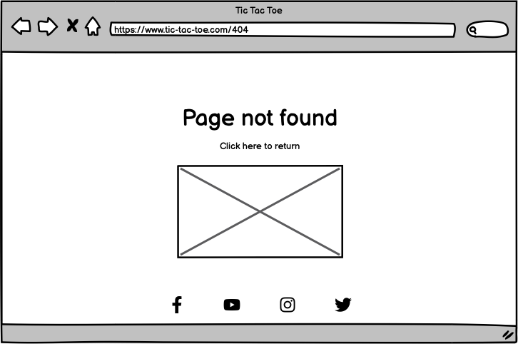

# Tic Tac Toe

This website is a simple online version of the classic turn-taking game Tic Tac Toe. Everything the player needs, from starting the game, reading the instructions, and providing feedback, is easily accessible from the main page.

Visit the deployed website [here](https://sarah-bue.github.io/tic-tac-toe/).

## Table of contents
1. [User Experience (UX)](#user-experience-ux)
    1. [Project Goals](#project-goals)
    2. [User Stories](#user-stories)
    3. [Color Scheme](#color-scheme)
    4. [Typography](#typography)
    5. [Wireframes](#wireframes)
2. [Features](#features)
3. [Technologies Used](#technologies-used)
    1. [Languages](#languagesd)
    2. [Frameworks, Libraries, and Programs](#frameworks-libraries-and-programs)
4. [Testing](#testing)
    1. [Testing User Stories](#testing-user-stories)
    2. [Code Validation](#code-validation)
    3. [Accessibility](#accessibility)
    4. [Tools Testing](#tools-testing)
    5. [Manual Testing](#manual-testing)
5. [Finished Product](#finished-product)
6. [Deployment](#deployment)
    1. [GitHub Pages](#github-pages)
7. [Credits](#credits)
    1. [Content](#content)
    2. [Media](#media)
    3. [Code](#code)
8. [Acknowledgements](#acknowledgements)

## User Experience (UX)
### Project Goals

### User Stories

### Color Scheme

The body of the website uses an off-white color (#E2E6EA - Anti-Flash White), combined with a medium gray color (#475B63 - Payne's Gray) for the main area.

The board itself uses a brown-gray color (#986C6A - Rose Taupe), with player marks and grids displaying in the off-white color of the body.

Win / Draw announcements are displayed in a brighter, orance color (#FFB140 - Orange (web)).

### Typography

The site uses Gloria Hallelujah, imported from Google Fonts, as its main font.

The fallback font, in case Gloria Hallelujah isn't loaded correctly, is Sans Serif.

### Wireframes

Page | Desktop Version | Mobile Version
--- | --- | ---
Home |  | 
Feedback |  | 
Instructions |  | 
404 |  | 

[Back to top ⇧](#tic-tac-toe)

## Features

[Back to top ⇧](#tic-tac-toe)

## Technologies Used
### Languages

### Frameworks, Libraries, and Programs 

[Back to top ⇧](#tic-tac-toe)

## Testing
### Testing User Stories

### Code Validation

**HTML Validation**

**CSS Validation**

**JavaScript Validation**

### Accessibility

**Lighthouse Reports**

### Tools Testing

### Manual Testing
**Browser Compatibility**
Browser | Issues 
--- | --- 

**Device Compatibility**
Device | Issues 
--- | --- 

**Common Elements Testing**

[Back to top ⇧](#tic-tac-toe)

## Finished Product

Page | Desktop Version | Mobile Version
--- | --- | ---

[Back to top ⇧](#tic-tac-toe)

## Deployment

### GitHub Pages

[Back to top ⇧](#tic-tac-toe)

## Credits

### Content
All content was written by the developer.

### Media
The image used for the Favicon was generated by Alex Buettner using [Getimg.ai](https://getimg.ai/).

The sounds used on the website are by floraphonic, and downloaded from [Pixabay](https://pixabay.com/).

### Code
[Stack Overflow](https://stackoverflow.com/), [W3Schools](https://www.w3schools.com/), and the "OpenJavaScript" channel on [YouTube](https://www.youtube.com/@OpenJavaScript) were consulted on a regular basis for both inspiration and to gain a deeper understanding of certain parts of the code.

The code for the pop-up form has been adapted from the W3Schools code found [here](https://www.w3schools.com/howto/howto_js_popup_form.asp).

The code to remove the outer borders of the board has been adapted from Patricia Nicole Opetina's code found on [Dev.to](https://dev.to/pat_the99/how-to-remove-outside-borders-of-a-3x3-grid-using-css-e-g-tic-tac-toe-ui-4ao8).

[Back to top ⇧](#tic-tac-toe)

## Acknowledgements

